# Bracket Lynx Architecture

## Overview

**Bracket Lynx** enhances the development experience by displaying a decoration next to each closing parenthesis. This decoration indicates the name of the corresponding block or function, along with its start and end line numbers, providing developers with a clear and immediate understanding of the code's structure and scope.

## How it Works

When a user activates the **Bracket Lynx** extension in VS Code:

1. The `package.json` file registers commands and configuration through the `contributes` field
2. The **Core Parser Engine** analyzes document content using optimized parsing algorithms
3. The **Lens System** generates intelligent bracket decorations with contextual headers
4. The **Toggle System** provides granular control over decoration visibility and behavior
5. The **Color System** enables dynamic customization of decoration appearance
6. Supporting **Performance Optimizations** ensure smooth operation across different file sizes

> 💡 **Smart Filtering:**  
> Bracket Lynx uses intelligent content filtering to exclude noise symbols and focus on meaningful code structure, supporting 25+ programming languages with language-specific rules.

---

## Architecture Diagram

```mermaid
graph TB
    subgraph "📦 Bracket Lynx Extension"
        direction TB
        A[package.json<br/>📋 Main Configuration]
        
        subgraph "🔧 Core Engine"
            direction TB
            B[extension.ts<br/>🚀 Entry Point]
            C[BracketLynx<br/>🎯 Main Controller]
            
            subgraph "⚡ Parser System"
                D[OptimizedBracketParser<br/>🏃 Performance Parser]
                E[BracketParser<br/>📝 Standard Parser]
                F[parser-exceptions.ts<br/>🛡️ Exception Handler]
            end
            
            subgraph "🎨 Lens System"
                G[lens.ts<br/>👁️ Core Lens Logic]
                H[BracketHeaderGenerator<br/>📄 Header Creation]
                I[BracketDecorationGenerator<br/>✨ Decoration Engine]
                J[language-formatter.ts<br/>🌐 Language Support]
                K[lens-rules.ts<br/>📋 Filtering Rules]
            end
        end
        
        subgraph "🎛️ Control Systems"
            direction LR
            L[toggle.ts<br/>🔄 Toggle Manager]
            M[colors.ts<br/>🎨 Color Manager]
            
            subgraph "🎯 Action Options"
                N[🌐 Global Toggle<br/>Extension-wide]
                O[📄 File Toggle<br/>Per-file control]
                P[♻️ Refresh<br/>Force update]
                Q[🎨 Color Picker<br/>Live preview]
            end
        end
        
        subgraph "⚡ Performance Layer"
            direction TB
            R[performance-cache.ts<br/>💾 Cache Management]
            S[performance-parser.ts<br/>🚀 Optimized Parsing]
            
            subgraph "📊 Cache System"
                T[AdvancedCacheManager<br/>🧠 Smart Caching]
                U[DocumentCache<br/>📄 Doc-level Cache]
                V[EditorCache<br/>🖥️ Editor-level Cache]
            end
        end
        
        subgraph "📚 Language Support"
            direction LR
            W[25+ Languages<br/>🌐 Multi-language]
            X[Smart Filtering<br/>🎯 Content Rules]
            Y[Header Generation<br/>📝 Context Headers]
        end
    end
    
    subgraph "🎯 VS Code Integration"
        direction TB
        Z[Extension Host<br/>🏠 Runtime Environment]
        
        subgraph "⚙️ VS Code APIs"
            direction LR
            AA[TextEditor API<br/>📝 Editor Integration]
            AB[Decoration API<br/>✨ Visual Effects]
            AC[Command API<br/>⌨️ User Commands]
            AD[Configuration API<br/>⚙️ Settings]
        end
        
        AE[User Interface<br/>👤 Editor Experience]
    end
    
    %% Main connections
    A --> B
    B --> C
    C --> D
    C --> E
    C --> F
    G --> H
    G --> I
    G --> J
    G --> K
    L --> N
    L --> O
    L --> P
    M --> Q
    R --> T
    R --> U
    R --> V
    S --> D
    
    %% Integration connections
    A -.-> Z
    C -.-> AA
    I -.-> AB
    L -.-> AC
    M -.-> AC
    B -.-> AD
    AA --> AE
    AB --> AE
    AC --> AE
    Z --> AA
    Z --> AB
    Z --> AC
    Z --> AD
    
    %% Cross-system connections
    C --> G
    C --> L
    C --> M
    C --> R
    G --> R
    L --> C
    M --> C
    
    %% Styling
    classDef mainConfig fill:#ff6b6b,stroke:#333,stroke-width:2px,color:#fff
    classDef coreEngine fill:#4ecdc4,stroke:#333,stroke-width:2px,color:#fff
    classDef parser fill:#45b7d1,stroke:#333,stroke-width:2px,color:#fff
    classDef lens fill:#96ceb4,stroke:#333,stroke-width:2px,color:#fff
    classDef controls fill:#feca57,stroke:#333,stroke-width:2px,color:#000
    classDef performance fill:#a8e6cf,stroke:#333,stroke-width:2px,color:#000
    classDef integration fill:#dda0dd,stroke:#333,stroke-width:2px,color:#000
    classDef output fill:#ffb3ba,stroke:#333,stroke-width:2px,color:#000
    
    class A mainConfig
    class B,C coreEngine
    class D,E,F parser
    class G,H,I,J,K lens
    class L,M,N,O,P,Q controls
    class R,S,T,U,V performance
    class W,X,Y lens
    class Z,AA,AB,AC,AD integration
    class AE output

```



## 🎯 Core Systems

### 🔧 Parser Engine

The heart of Bracket Lynx is its **dual-parser system** designed for optimal performance:

- **OptimizedBracketParser**: High-performance parser with incremental parsing capabilities
- **Standard BracketParser**: Fallback parser for complex scenarios
- **Exception Handler**: Manages parsing exceptions for problematic files (minified, Astro, etc.)

**Key Features:**
- 🚀 **Incremental Parsing**: Updates only changed portions of documents
- 💾 **Smart Caching**: Multi-level cache system with hit ratio optimization  
- 🎯 **Performance Filters**: Automatic detection and handling of large files
- 🛡️ **Error Recovery**: Graceful handling of parsing failures

### 👁️ Lens System

The **Lens System** transforms parsed bracket data into meaningful visual decorations:

```typescript
// Core components working together
BracketParser → BracketHeaderGenerator → BracketDecorationGenerator → VS Code Decorations
```

**Intelligence Features:**
- 📝 **Context Headers**: Generates meaningful headers from surrounding code
- 🎯 **Smart Filtering**: Removes noise symbols and focuses on structure  
- 🌐 **Language Awareness**: Adapts behavior for different programming languages
- ✨ **Dynamic Decorations**: Real-time updates as code changes

### 🎛️ Control Systems

**Toggle System** - Granular control over decoration behavior:

| Control Type | Scope | Persistence | Description |
|--------------|-------|-------------|-------------|
| 🌐 **Global Toggle** | Extension-wide | Session | Enable/disable for all files |
| 📄 **File Toggle** | Per-file | Persistent | Control individual file decoration |
| ♻️ **Refresh** | Current file | Immediate | Force decoration update |

**Color System** - Advanced color customization:

| Feature | Capability | Persistence |
|---------|------------|-------------|
| 🌈 **Built-in Colors** | Predefined color palette | Workspace-wide |
| #️⃣ **Custom Hex** | Any valid hex color | Workspace-wide |
| 👀 **Live Preview** | Real-time color changes | Temporary |

## ⚡ Performance Architecture

### 📊 Multi-Level Caching

```
Document Level Cache ──────┐
                          ├── AdvancedCacheManager
Editor Level Cache ────────┤
                          │
Parse State Cache ─────────┘
```

**Cache Strategy:**
- **Document Cache**: Stores parsed bracket information per document
- **Editor Cache**: Maintains decoration state per editor instance  
- **Parse State Cache**: Optimizes incremental parsing operations
- **Memory Management**: Automatic cleanup and low-memory mode

### 🚀 Performance Optimizations

- **File Size Limits**: Configurable limits for large files (default: 10MB)
- **Decoration Limits**: Maximum decorations per file (default: 500)
- **Debouncing**: Smart update timing to prevent excessive re-parsing
- **Background Processing**: Non-blocking operations for large files

## 🌐 Language Support

### Supported Languages (25+)

```
JavaScript/TypeScript • React/JSX • Vue • Svelte • Astro
CSS/SCSS/Sass/Less • HTML/XML • JSON/JSONC
Python • Java • C/C++ • C# • Rust • Go • Dart • PHP
```

### 🎯 Smart Filtering Rules

**Content Filtering System:**
- **Symbol Exclusion**: Removes noise symbols (`!`, `$`, `%`, etc.)
- **Word Limiting**: Focuses on meaningful code structure
- **Exception Handling**: Special rules for keywords like `export`
- **Language-Specific**: Adapts filtering based on file type

## 📁 Project Structure

```
bracket-lynx/
├── src/
│   ├── extension.ts                 # 🚀 Main entry point
│   ├── core/                        # ⚡ Performance systems
│   │   ├── config.ts                # ⚙️ Extension config manager
│   │   ├── performance-cache.ts     # 💾 Advanced caching
│   │   ├── performance-parser.ts    # 🏃 Optimized parsing
│   │   ├── parser-exceptions.ts     # 🛡️ Exception handling
│   │   └── utils.ts                 # 🛠️ Core utilities
│   ├── lens/                        # 👁️ Core lens system
│   │   ├── lens.ts                  # 🎯 Main lens logic
│   │   ├── language-formatter.ts    # 🌐 Language support
│   │   ├── lens-rules.ts            # 📋 Filtering rules
│   │   └── decorators/
│   │       └── astrojs-decorator.ts # 🌟 AstroJS specific decorator
│   ├── actions/                     # 🎛️ Control systems
│   │   ├── toggle.ts                # 🔄 Toggle management
│   │   └── colors.ts                # 🎨 Color system
│   └── __test__/                    # 🧪 Test suite
│       ├── extension.test.ts        # 🧪 Extension tests
│       ├── test-feature_astro.md    # 🧪 Astro feature test
│       ├── test-refactor.md         # 🧪 Refactor test
│       ├── test-v0.4.0.md           # 🧪 v0.4.0 test
│       ├── test-v0.5.0.md           # 🧪 v0.5.0 test
│       ├── test-v0.6.0.md           # 🧪 v0.6.0 test
│       └── TESTING_GUIDE.md         # 📖 Testing guide
├── assets/                          # 🖼️ Resources
│   ├── icon.png                     # 🖼️ Extension icon
│   └── images/
│       ├── screenshot.jpg           # 🖼️ Screenshot
│       └── star.png                 # 🖼️ Star icon
├── package.json                     # 📋 Extension config
├── README.md                        # 📖 Documentation
├── ARCHITECTURE.md                  # 🏗️ Architecture overview
├── CHANGELOG.md                     # 📝 Changelog
├── CODE_OF_CONDUCT.md               # 📜 Code of conduct
├── CONTRIBUTING.md                  # 🤝 Contribution guide
├── esbuild.js                       # ⚡ Esbuild config
├── eslint.config.mjs                # 🧹 ESLint config
├── LICENSE                          # 📄 License
├── tsconfig.json                    # 🛠️ TypeScript config
├── vsc-extension-quickstart.md      # 🚀 VS Code quickstart
```

## 🎹 Key Features

### 🤖 Intelligent Processing

- **Smart Header Generation**: Extracts meaningful context from code structure
- **Incremental Updates**: Processes only changed portions for performance
- **Language Adaptation**: Adjusts behavior based on programming language
- **Error Recovery**: Graceful handling of parsing edge cases

### 🎨 Visual Management

- **Dynamic Colors**: 5-color system with live preview capabilities
- **Flexible Display**: Configurable prefix and styling options
- **Context-Aware**: Headers adapt to code structure and nesting level
- **Performance Aware**: Automatic decoration limiting for large files

### ⚡ Performance Features

- **Memory Optimization**: Multi-level caching with automatic cleanup
- **File Size Handling**: Intelligent processing of large files
- **Background Operations**: Non-blocking parsing for smooth experience
- **Metrics Tracking**: Performance monitoring and optimization

## 🚀 Installation & Configuration

### Requirements

- **VS Code**: Version 1.74.0 or higher
- **Operating System**: Windows, macOS, Linux
- **Memory**: Optimized for minimal memory usage

### Key Configuration Options

```json
{
  "bracketLynx.mode": "auto",
  "bracketLynx.color": "#515151",
  "bracketLynx.maxFileSize": 10485760,
  "bracketLynx.maxDecorationsPerFile": 500,
  "bracketLynx.enablePerformanceFilters": true
}
```

## 🎯 Usage Workflow

1. **Install**: Search "Bracket Lynx" in VS Code Extensions
2. **Activate**: Extension activates automatically for supported languages
3. **Control**: Use `Ctrl+Shift+P` → "Bracket Lynx: Toggle & Refresh 🛠️"
4. **Customize**: Access color picker through toggle menu or command palette
5. **Monitor**: Performance metrics available in debug mode

## Conclusion

**Bracket Lynx** delivers an intelligent, performance-optimized solution for code structure visualization in Visual Studio Code. Through its sophisticated architecture combining advanced parsing, intelligent caching, and flexible control systems, it provides developers with enhanced code readability without compromising editor performance.

### Key Benefits

- 🎯 **Intelligent Structure Visualization**: Smart bracket headers with contextual information
- ⚡ **Performance Optimized**: Multi-level caching and incremental parsing
- 🌐 **Multi-Language Support**: 25+ programming languages with language-specific rules
- 🎛️ **Granular Control**: Per-file and global toggle capabilities
- 🎨 **Visual Customization**: Advanced color system with live preview
- 💾 **Memory Efficient**: Automatic cleanup and low-memory mode
- 🛡️ **Error Resilient**: Robust exception handling and graceful degradation

**Result**: A maintainable, scalable system that enhances code comprehension while maintaining optimal performance across projects of any size. Perfect for developers who value both functionality and performance in their development environment.