# Bracket Lynx Architecture

## Overview

**Bracket Lynx** enhances the development experience by displaying intelligent decorations next to each closing parenthesis. These decorations indicate the name of the corresponding block or function, along with its start and end line numbers, providing developers with a clear and immediate understanding of the code's structure and scope.

## How it Works

When a user activates the **Bracket Lynx** extension in VS Code:

1. The `package.json` file registers commands and configuration through the `contributes` field
2. The **Core Performance Engine** analyzes document content using optimized parsing algorithms
3. The **Multi-Decorator System** generates intelligent bracket decorations with contextual headers for specific languages
4. The **Universal Lens System** handles general bracket detection and decoration
5. The **Toggle & Control System** provides granular control over decoration visibility and behavior
6. The **Color Management System** enables dynamic customization of decoration appearance
7. Supporting **Performance Optimizations** ensure smooth operation across different file sizes

> 💡 **Smart Language Detection:**  
> Bracket Lynx uses intelligent language-specific decorators alongside a universal system, supporting 25+ programming languages with specialized rules for Astro, Vue, Svelte, and JavaScript/TypeScript.

---

## Architecture Diagram

```mermaid
graph TB
    subgraph "📦 Bracket Lynx Extension v0.7.0"
        direction TB
        A[package.json<br/>📋 Extension Configuration]
        
        subgraph "🚀 Core Entry Point"
            direction TB
            B[extension.ts<br/>🎯 Main Controller & Event Orchestrator]
        end
        
        subgraph "⚡ Performance Core"
            direction TB
            C[performance-config.ts<br/>🛡️ Config, Logging & Error Handling]
            D[performance-cache.ts<br/>💾 Advanced Multi-Level Caching]
            E[performance-parser.ts<br/>🏃 Optimized Parsing Engine]
        end
        
        subgraph "👁️ Universal Lens System"
            direction TB
            F[lens.ts<br/>🎯 BracketLynx Main Controller]
            G[language-formatter.ts<br/>🌐 Language-Specific Formatting]
            H[lens-rules.ts<br/>📋 Smart Filtering Rules]
        end
        
        subgraph "🎨 Specialized Decorators"
            direction LR
            I[astro-decorator.ts<br/>🌟 Astro/HTML Support]
            J[vue.decorator.ts<br/>💚 Vue.js Support]
            K[svelte.decorator.ts<br/>🧡 Svelte Support]
            L[js-ts-function-decorator.ts<br/>⚡ JS/TS Function Symbols]
        end
        
        subgraph "🎛️ Action & Control Systems"
            direction LR
            M[toggle.ts<br/>🔄 Toggle & Menu Management]
            N[colors.ts<br/>🎨 Dynamic Color System]
            
            subgraph "🎯 Control Features"
                O[🌐 Global Toggle<br/>Extension-wide]
                P[📄 File Toggle<br/>Per-file control]
                Q[♻️ Refresh<br/>Force update]
                R[🧹 Memory Cleanup<br/>Cache management]
                S[🎨 Color Picker<br/>Live preview]
            end
        end
        
        subgraph "🧪 Testing Infrastructure"
            direction TB
            T[simple.test.ts<br/>🧪 Comprehensive Test Suite]
            U[test-setup.ts<br/>🛠️ Test Utilities & Mocks]
            
            subgraph "📚 Test History"
                V[test_v0.4.0.md<br/>📝 v0.4.0 Tests]
                W[test_v0.5.0.md<br/>📝 v0.5.0 Tests]
                X[test_v0.6.0.md<br/>📝 v0.6.0 Tests]
                Y[test_v0.7.0.md<br/>📝 v0.7.0 Tests]
                Z[TESTING_GUIDE.md<br/>📖 Testing Documentation]
            end
        end
    end
    
    subgraph "🎯 VS Code Integration"
        direction TB
        AA[Extension Host<br/>🏠 Runtime Environment]
        
        subgraph "⚙️ VS Code APIs"
            direction LR
            BB[TextEditor API<br/>📝 Editor Integration]
            CC[Decoration API<br/>✨ Visual Effects]
            DD[Command API<br/>⌨️ User Commands]
            EE[Configuration API<br/>⚙️ Settings Management]
        end
        
        FF[User Interface<br/>👤 Enhanced Editor Experience]
    end
    
    %% Main flow connections
    A --> B
    B --> C
    B --> D
    B --> E
    B --> F
    B --> G
    B --> H
    B --> I
    B --> J
    B --> K
    B --> L
    B --> M
    B --> N
    
    %% Core system interactions
    F --> G
    F --> H
    F --> D
    F --> E
    M --> O
    M --> P
    M --> Q
    M --> R
    N --> S
    
    %% Testing connections
    T --> U
    T --> V
    T --> W
    T --> X
    T --> Y
    U --> Z
    
    %% VS Code integration
    A -.-> AA
    B -.-> BB
    F -.-> CC
    I -.-> CC
    J -.-> CC
    K -.-> CC
    M -.-> DD
    N -.-> DD
    B -.-> EE
    AA --> BB
    AA --> CC
    AA --> DD
    AA --> EE
    BB --> FF
    CC --> FF
    DD --> FF
    
    %% Cross-system dependencies
    F --> C
    I --> C
    J --> C
    K --> C
    M --> C
    N --> C
    
    %% Styling
    classDef mainConfig fill:#ff6b6b,stroke:#333,stroke-width:2px,color:#fff
    classDef coreEngine fill:#4ecdc4,stroke:#333,stroke-width:2px,color:#fff
    classDef performance fill:#45b7d1,stroke:#333,stroke-width:2px,color:#fff
    classDef lens fill:#96ceb4,stroke:#333,stroke-width:2px,color:#fff
    classDef decorators fill:#feca57,stroke:#333,stroke-width:2px,color:#000
    classDef controls fill:#ff9ff3,stroke:#333,stroke-width:2px,color:#000
    classDef testing fill:#a8e6cf,stroke:#333,stroke-width:2px,color:#000
    classDef integration fill:#dda0dd,stroke:#333,stroke-width:2px,color:#000
    classDef output fill:#ffb3ba,stroke:#333,stroke-width:2px,color:#000
    
    class A mainConfig
    class B coreEngine
    class C,D,E performance
    class F,G,H lens
    class I,J,K,L decorators
    class M,N,O,P,Q,R,S controls
    class T,U,V,W,X,Y,Z testing
    class AA,BB,CC,DD,EE integration
    class FF output
```



## 🎯 Core Systems

### 🚀 Entry Point & Orchestration

The **extension.ts** serves as the main orchestrator, managing:

- **Extension Lifecycle**: Activation, deactivation, and cleanup
- **Event Handling**: Document changes, configuration updates, and editor events
- **System Initialization**: Setting up decorators, error handling, and persistent state
- **Universal Updates**: Coordinating between specialized decorators and universal lens

**Key Features:**
- 🎯 **Smart Activation**: Language-specific activation events
- 🔄 **Event Coordination**: Unified handling of VS Code events
- 🛡️ **Error Recovery**: Comprehensive error handling and logging
- 🧹 **Memory Management**: Automatic cleanup and state persistence

### ⚡ Performance Core

The **performance core** consists of three main components:

**performance-config.ts** - Central configuration and utilities:
- 🛡️ **Error Handling**: Comprehensive error classes and logging system
- ⚙️ **Configuration Management**: Performance limits and language support
- 🧪 **Utilities**: Text processing, validation, and helper functions
- 📊 **Logging System**: Multi-level logging with categorization

**performance-cache.ts** - Advanced caching system:
- 💾 **Multi-Level Caching**: Document, editor, and parse state caches
- 🧠 **Smart Management**: Automatic cleanup and memory optimization
- 📈 **Performance Metrics**: Cache hit ratios and health monitoring
- 🔄 **Incremental Updates**: Efficient partial cache invalidation

**performance-parser.ts** - Optimized parsing engine:
- 🏃 **High-Performance Parsing**: Optimized algorithms for large files
- 🎯 **Smart Filtering**: Content-aware parsing with exception handling
- 📊 **Performance Monitoring**: Timing and memory usage tracking
- 🛡️ **Fallback Mechanisms**: Graceful degradation for problematic files

### 👁️ Universal Lens System

The **lens system** provides core bracket detection and decoration:

**lens.ts (BracketLynx)** - Main universal controller:
- 🎯 **Bracket Detection**: Universal bracket parsing and matching
- ✨ **Decoration Management**: Dynamic decoration creation and updates
- 🔄 **State Management**: Document and editor state tracking
- 📊 **Performance Integration**: Cache utilization and optimization

**language-formatter.ts** - Language-specific formatting:
- 🌐 **Multi-Language Support**: 25+ programming languages
- 🎨 **Context-Aware Formatting**: Intelligent header generation
- 🎯 **Smart Filtering**: Language-specific content rules
- 📝 **Header Generation**: Meaningful context extraction

**lens-rules.ts** - Intelligent filtering rules:
- 🎯 **Content Filtering**: Noise symbol removal and focus rules
- 📋 **Rule Engine**: Language-specific filtering logic
- 🛡️ **Exception Handling**: Special case management
- 🔍 **Pattern Recognition**: Advanced content analysis

### 🎨 Specialized Decorators

**Language-Specific Decorators:**

**astro-decorator.ts** - Astro/HTML support:
- 🌟 **Astro Framework**: Specialized Astro file handling
- 🏷️ **HTML Integration**: HTML tag and structure support
- 🎯 **Template Analysis**: Component and template parsing
- ⚡ **Performance Optimized**: Efficient processing for complex templates

**vue.decorator.ts** - Vue.js support:
- 💚 **Vue Components**: Single File Component (SFC) support
- 🎨 **Template Processing**: Vue template syntax handling
- 🔄 **Reactive Updates**: Vue-specific state management
- 🛠️ **Composition API**: Modern Vue 3 support

**svelte.decorator.ts** - Svelte support:
- 🧡 **Svelte Components**: .svelte file processing
- 🎯 **Compile-Time Analysis**: Svelte-specific syntax handling
- 🔄 **Reactivity Tracking**: Svelte reactivity patterns
- ⚡ **Optimized Rendering**: Efficient decoration updates

**js-ts-function-decorator.ts** - JavaScript/TypeScript function symbols:
- ⚡ **Function Detection**: Arrow functions, async functions, methods
- 🎨 **Symbol Management**: Customizable function symbols
- 🔧 **TypeScript Support**: Generic and complex type handling
- 📊 **Pattern Recognition**: Advanced function pattern matching

**Symbol System:**
```typescript
FUNCTION_SYMBOLS = {
  NORMAL_ARROW: '❨❩➤',
  COLLECTION_ARROW: '⮞',
  ASYNC_FUNCTION: '⧖',
  COMPLEX_FUNCTION: '⇄'
}
```

### 🎛️ Action & Control Systems

**toggle.ts** - Advanced toggle and menu management:

| Control Type         | Scope           | Persistence         | Description |
|---------------------|-----------------|---------------------|-------------|
| 🌐 **Global Toggle** | Extension-wide  | Configuration       | Enable/disable across all files |
| 📄 **File Toggle**   | Per-file        | Configuration       | Individual file control |
| ♻️ **Refresh**       | Current file    | Immediate           | Force decoration update |
| 🧹 **Memory Cleanup**| Extension-wide  | Immediate           | Cache and memory management |
| 🛠️ **Interactive Menu** | Extension-wide | Dynamic          | QuickPick interface with live stats |

**colors.ts** - Dynamic color management system:

| Feature              | Capability                | Persistence         |
|----------------------|--------------------------|---------------------|
| 🌈 **Preset Colors** | Built-in color palette   | Workspace           |
| #️⃣ **Custom Colors**  | Hex color input          | Workspace           |
| 👀 **Live Preview**    | Real-time updates        | Session             |
| 🎨 **Color Picker**    | Interactive selection    | Immediate           |
| 🔄 **Auto-Sync**      | Configuration sync       | Persistent          |

### 🧪 Testing Infrastructure

**Comprehensive Test Suite:**

**simple.test.ts** - Main test file:
- 🚀 **Quick Tests**: Basic functionality (5s timeout)
- 🔄 **Integration Tests**: System integration (10s timeout)  
- ⚡ **Performance Tests**: Large file and memory tests (30s timeout)
- 📊 **Metrics Validation**: Performance benchmarks

**test-setup.ts** - Test utilities and mocks:
- 🛠️ **Mock System**: VS Code API mocking
- 📝 **Test Data**: Sample code generation
- ⏱️ **Performance Tools**: Timing and memory measurement
- 🎯 **Language Samples**: Multi-language test cases

**Test Categories:**
```typescript
TEST_CONFIG = {
  QUICK_TIMEOUT: 5000,
  INTEGRATION_TIMEOUT: 10000,
  PERFORMANCE_TIMEOUT: 30000,
  PERFORMANCE_LIMITS: {
    LARGE_FILE_PARSE_MS: 2000,
    MULTIPLE_PARSES_MS: 5000,
    MEMORY_INCREASE_MB: 50
  }
}
```

## 📁 Project Structure

```
bracket-lynx/
├── src/
│   ├── extension.ts                 # 🚀 Main entry point & orchestration
│   ├── core/                        # ⚡ Performance & configuration
│   │   ├── performance-config.ts    # 🛡️ Config, logging & error handling
│   │   ├── performance-cache.ts     # 💾 Advanced multi-level caching
│   │   └── performance-parser.ts    # 🏃 Optimized parsing engine
│   ├── lens/                        # 👁️ Universal lens system
│   │   ├── lens.ts                  # 🎯 BracketLynx main controller
│   │   ├── language-formatter.ts    # 🌐 Language-specific formatting
│   │   ├── lens-rules.ts            # 📋 Smart filtering rules
│   │   └── decorators/              # 🎨 Specialized decorators
│   │       ├── astro-decorator.ts   # 🌟 Astro/HTML support
│   │       ├── vue.decorator.ts     # 💚 Vue.js support
│   │       ├── svelte.decorator.ts  # 🧡 Svelte support
│   │       └── js-ts-function-decorator.ts # ⚡ JS/TS function symbols
│   ├── actions/                     # 🎛️ Control systems
│   │   ├── toggle.ts                # 🔄 Toggle & menu management
│   │   └── colors.ts                # 🎨 Dynamic color system
│   └── __test__/                    # 🧪 Testing infrastructure
│       ├── simple.test.ts           # 🧪 Comprehensive test suite
│       ├── test-setup.ts            # 🛠️ Test utilities & mocks
│       ├── TESTING_GUIDE.md         # 📖 Testing documentation
│       └── test-history/            # 📚 Version test history
│           ├── test_v0.4.0.md       # 📝 v0.4.0 tests
│           ├── test_v0.5.0.md       # 📝 v0.5.0 tests
│           ├── test_v0.6.0.md       # 📝 v0.6.0 tests
│           └── test_v0.7.0.md       # 📝 v0.7.0 tests
├── assets/                          # 🖼️ Resources
│   ├── icon.png                     # 🖼️ Extension icon
│   └── images/
│       ├── screenshot.jpg           # 🖼️ Screenshot
│       └── star.png                 # 🖼️ Star icon
├── dist/                            # 📦 Build output
├── node_modules/                    # 📚 Dependencies
├── .vscode/                         # 🔧 VS Code workspace settings
├── package.json                     # 📋 Extension configuration
├── README.md                        # 📖 User documentation
├── ARCHITECTURE.md                  # 🏗️ Architecture overview (this file)
├── CHANGELOG.md                     # 📝 Version history
├── CODE_OF_CONDUCT.md               # 📜 Community guidelines
├── CONTRIBUTING.md                  # 🤝 Contribution guide
├── esbuild.js                       # ⚡ Build configuration
├── eslint.config.mjs                # 🧹 Code quality rules
├── tsconfig.json                    # 🛠️ TypeScript configuration
├── .mocharc.json                    # 🧪 Test configuration
├── .prettierrc                      # 🎨 Code formatting
└── LICENSE                          # 📄 MIT License
```

## 🌐 Language Support & Activation

### Supported Languages (25+)

**Core Web Technologies:**
```
JavaScript • TypeScript • React (JSX/TSX) • Vue.js • Svelte • Astro
HTML • CSS • SCSS • Sass • Less • JSON • JSONC
```

**Backend & Systems:**
```
Python • Java • C/C++ • C# • Rust • Go • Dart • PHP
```

### Activation Events

```json
"activationEvents": [
  "onLanguage:javascript", "onLanguage:typescript",
  "onLanguage:javascriptreact", "onLanguage:typescriptreact",
  "onLanguage:html", "onLanguage:css", "onLanguage:scss",
  "onLanguage:vue", "onLanguage:astro", "onLanguage:svelte",
  "onLanguage:json"
]
```

## ⚡ Performance Architecture

### 📊 Multi-Level Caching Strategy

```
Document Cache     ──┐
Editor Cache       ──├── AdvancedCacheManager
Parse State Cache  ──┘       │
                             ├── Memory Optimization
                             ├── Auto Cleanup
                             └── Performance Metrics
```

### 🚀 Performance Features

- **File Size Management**: Configurable limits (default: 10MB)
- **Decoration Limits**: Maximum decorations per file (default: 500)
- **Smart Debouncing**: Intelligent update timing
- **Incremental Parsing**: Process only changed content
- **Memory Monitoring**: Automatic cleanup and health tracking
- **Background Processing**: Non-blocking operations

### 🛡️ Error Handling & Recovery

**Error Class Hierarchy:**
```typescript
BracketLynxError (base)
├── ParseError
├── CacheError
├── ConfigurationError
├── PerformanceError
├── DecorationError
└── DocumentError
```

**Recovery Mechanisms:**
- **Graceful Degradation**: Fallback to basic parsing
- **Automatic Retry**: Smart retry logic with exponential backoff
- **Exception Handling**: Specialized handling for problematic files
- **Safe Execution**: Wrapped operations with error boundaries

## 🎹 Key Features & Capabilities

### 🤖 Intelligent Processing

- **Hybrid Decoration System**: Universal + specialized decorators
- **Context-Aware Headers**: Language-specific header generation  
- **Smart Symbol Management**: Customizable function symbols
- **Incremental Updates**: Efficient partial reprocessing
- **Multi-Language Detection**: Automatic language adaptation

### 🎨 Visual Management

- **Dynamic Color System**: Live preview with persistence
- **Function Symbol Customization**: Configurable visual indicators
- **Flexible Styling**: Font style and prefix customization
- **Context-Responsive**: Adapts to code structure and nesting
- **Performance-Aware**: Automatic limiting for large files

### ⚡ Performance & Reliability

- **Memory Optimization**: Multi-level caching with cleanup
- **File Size Intelligence**: Automatic handling of large files
- **Background Processing**: Non-blocking parsing operations
- **Comprehensive Testing**: Quick, integration, and performance tests
- **Error Resilience**: Robust exception handling and recovery

## 🚀 Installation & Usage

### Requirements

- **VS Code**: Version 1.74.0 or higher
- **Memory**: Optimized for minimal usage with automatic cleanup
- **Languages**: Supports 25+ programming languages

### Key Configuration Options

```json
{
  "bracketLynx.mode": "auto",
  "bracketLynx.color": "#515151",
  "bracketLynx.fontStyle": "italic",
  "bracketLynx.prefix": "‹~ ",
  "bracketLynx.maxFileSize": 10485760,
  "bracketLynx.maxDecorationsPerFile": 500,
  "bracketLynx.enablePerformanceFilters": true,
  "bracketLynx.globalEnabled": true,
  "bracketLynx.debug": false
}
```

## 🎯 Usage Workflow

1. **Install**: Search "Bracket Lynx" in VS Code Extensions
2. **Auto-Activation**: Extension activates automatically for supported languages
3. **Interactive Control**: Use `Ctrl+Shift+P` → "Bracket Lynx: Toggle & Refresh 🛠️"
4. **Customize Colors**: Access color picker through toggle menu
5. **Monitor Performance**: Debug mode provides performance metrics
6. **File-Level Control**: Per-file enable/disable with persistence

## 🔮 Architecture Benefits

### 🎯 Modularity & Maintainability

- **Separation of Concerns**: Clear boundaries between systems
- **Specialized Decorators**: Language-specific optimizations
- **Universal Fallback**: Comprehensive coverage for all languages
- **Centralized Configuration**: Single source of truth for settings
- **Comprehensive Testing**: Multiple test categories with history tracking

### ⚡ Performance & Scalability

- **Multi-Level Caching**: Document, editor, and parse caches
- **Incremental Processing**: Only parse changed content
- **Memory Management**: Automatic cleanup and monitoring
- **Smart Limits**: Configurable thresholds for large files
- **Background Operations**: Non-blocking processing

### 🛡️ Reliability & Error Handling

- **Comprehensive Error System**: Specialized error classes
- **Graceful Degradation**: Fallback mechanisms
- **Recovery Chains**: Multi-step error recovery
- **Safe Execution**: Error boundaries and validation
- **Detailed Logging**: Multi-level logging with categorization

## Conclusion

**Bracket Lynx v0.7.0** represents a sophisticated, performance-optimized architecture that combines universal bracket detection with specialized language decorators. The hybrid approach ensures comprehensive coverage while maintaining optimal performance through advanced caching, intelligent parsing, and robust error handling.

### Key Architectural Strengths

- 🎯 **Hybrid System**: Universal + specialized decorators for optimal coverage
- ⚡ **Performance Core**: Advanced caching and optimized parsing engine
- 🌐 **Multi-Language**: 25+ languages with specialized framework support
- 🎛️ **Granular Control**: Per-file and global control with persistence
- 🧪 **Comprehensive Testing**: Multi-level test suite with performance benchmarks
- 🛡️ **Error Resilience**: Robust error handling and recovery mechanisms
- 💾 **Memory Efficient**: Automatic cleanup and intelligent cache management

**Result**: A maintainable, scalable, and highly performant VS Code extension that enhances code comprehension across a wide range of programming languages and frameworks, while maintaining optimal editor performance and providing extensive customization options for developers.